# Kanban: Estudo e Aplicações

## Introdução ao Kanban

O Kanban é uma metodologia visual para gerenciar fluxos de trabalho e otimizar processos. Abaixo, um resumo de como implementar o Kanban, baseado em Kniberg e Skarin (2009).

### Princípios do Kanban

1. **Desenho do Fluxo de Trabalho**:  
   - Divida o fluxo de trabalho atual em partes e visualize essas etapas em um quadro.

2. **Limitação de Trabalho em Progresso (WIP)**:  
   - Estabeleça limites explícitos para o número de itens que podem estar em progresso em cada fase do fluxo.

3. **Monitoramento do Fluxo**:  
   - Acompanhe a execução do processo, identificando gargalos, retrabalho, filas, variabilidade e desperdícios.

4. **Otimização do Processo**:  
   - O objetivo é minimizar o tempo de execução e tornar o fluxo mais previsível.

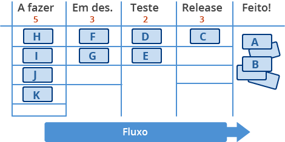

# Um dia na terra do Kanban

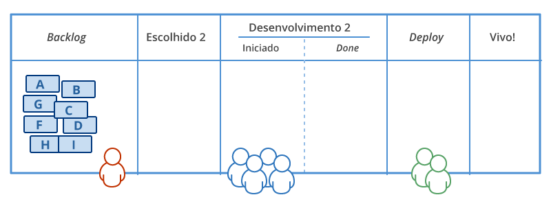

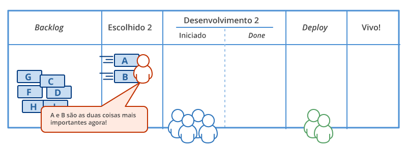

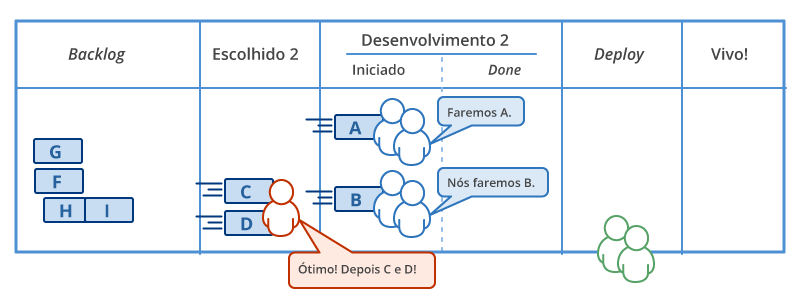

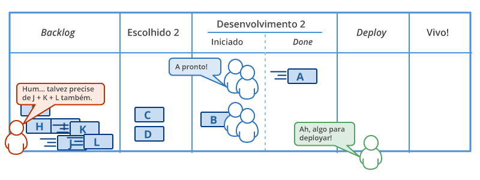

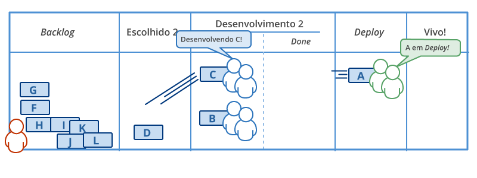

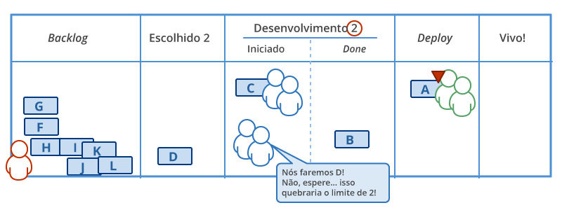

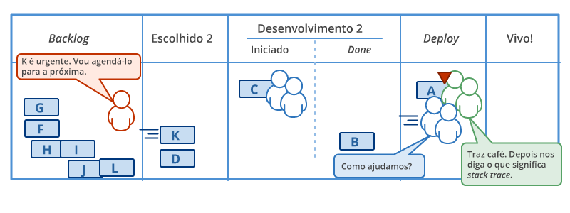

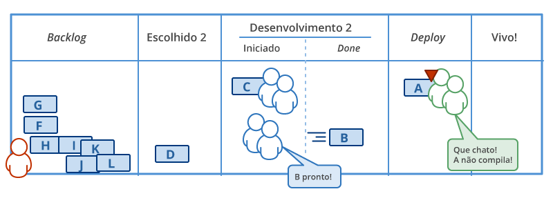

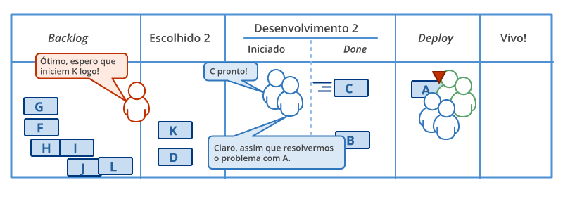

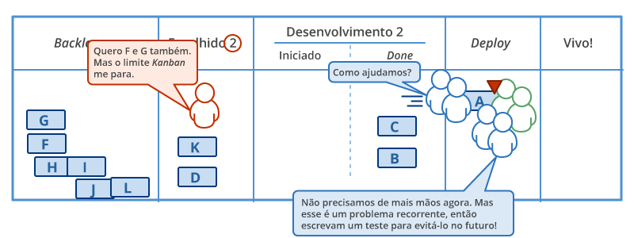

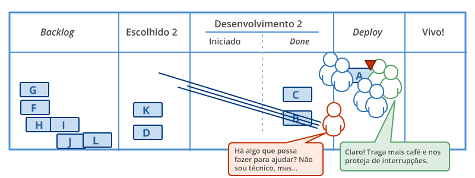

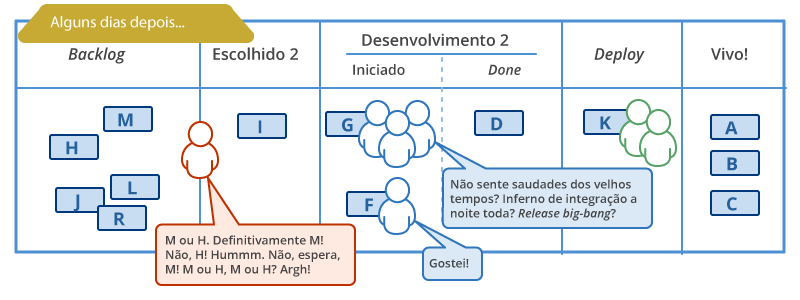

# Kanban e Ferramentas Ágeis

## SUMÁRIO

1. [Kanban e Ferramentas Ágeis](#kanban-e-ferramentas-ágeis)
2. [O que é Kanban](#o-que-é-kanban)
3. [Visibilidade no Kanban](#visibilidade-no-kanban)
4. [Work in Progress no Kanban](#work-in-progress-no-kanban)
5. [Ferramentas Ágeis](#ferramentas-ágeis)
6. [Sete Dimensões do Produto](#sete-dimensões-do-produto)
7. [Product Vision Box](#product-vision-box)
8. [Elevator Speech](#elevator-speech)
9. [Persona](#persona)
10. [História de Usuário ou User Story](#história-de-usuário-ou-user-story)
11. [Refinamento do Backlog](#refinamento-do-backlog)
12. [Planning Poker](#planning-poker)
13. [Escalas para Definição de Story Points](#escalas-para-definição-de-story-points)
14. [Sequência de Fibonacci](#sequência-de-fibonacci)
15. [Escalas Qualitativas](#escalas-qualitativas)
16. [Velocidade da Equipe](#velocidade-da-equipe)
17. [Mínimo Viável do Produto](#mínimo-viável-do-produto)
18. [Quadro de Tarefas](#quadro-de-tarefas)
19. [Burn Down Chart](#burn-down-chart)
20. [Burn Up Chart](#burn-up-chart)

---

### O que é Kanban

Em japonês, Kanban significa "cartão visual". O termo tem-se tornado quase sinônimo da implementação dos princípios Lean e de agilidade. Embora sistemas Kanban sejam um conceito relativamente novo em TI, vêm sendo utilizados por mais de 50 anos na Toyota para controlar visualmente a linha de produção. A metodologia se baseia em transparência total e comunicação em tempo real sobre capacidade de produção.

O Kanban é baseado em uma ideia simples: as atividades em andamento devem ser limitadas, de modo que uma nova atividade só deve ser iniciada quando a anterior for terminada.

#### Princípios do Kanban

- **Visualizar o trabalho**: Através de quadros Kanban, permitindo que todos vejam o que está acontecendo no fluxo de trabalho.
- **Limitar o trabalho em progresso (WIP)**: A quantidade de trabalho permitida em cada estágio do processo é restrita para evitar gargalos.
- **Políticas explícitas**: As regras e diretrizes de como o trabalho deve ser gerido são claras e visíveis.
- **Gerenciar o fluxo**: Medir o desempenho do fluxo de trabalho para otimizar a eficiência.
- **Criar uma cultura de melhoria contínua (Kaizen)**: O Kanban promove a responsabilidade coletiva pela melhoria constante dos processos.

Curiosidade: Kanban não é parte do Scrum, mas pode ser integrado ao Scrum, sendo chamado de "Scrumban".

## Kanban x Scrum

Kanban e Scrum são ambos frameworks ágeis, mas têm diferenças significativas. Aqui está um quadro comparativo entre os dois:

| **Aspecto**              | **Scrum**                              | **Kanban**                               |
|--------------------------|----------------------------------------|------------------------------------------|
| **Iterações**            | Timeboxed (sprints)                    | Iterações opcionais                     |
| **Limitação de WIP**     | Indireta (por sprint)                  | Direta (limites específicos por estágio) |
| **Comprometimento**      | Compromisso com quantidade de trabalho | Compromisso opcional                    |
| **Papéis**               | PO, SM, time                           | Sem papéis definidos                    |
| **Priorização**          | Product Backlog priorizado             | Priorização opcional                    |
| **Estimativas**          | Necessárias para planejamento         | Estimativas opcionais                   |

---

## Visibilidade no Kanban

A visibilidade no Kanban permite tomar decisões bem embasadas. O primeiro passo para isso é entender o processo atual, mapeando o fluxo de trabalho.

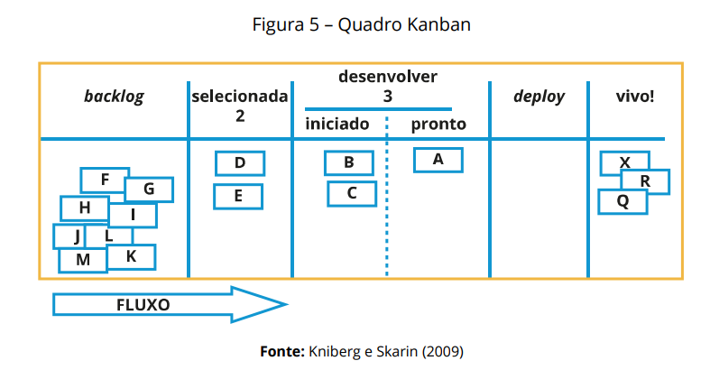

### Quadro Kanban e seus cartões

O quadro Kanban é composto por cartões que representam as tarefas em cada estágio do processo. As colunas no Kanban representam diferentes etapas do desenvolvimento.

### Cores e Tipos de Cartões

As equipes podem usar **cores diferentes** para representar tipos de tarefas, como:
- **Histórias de Usuário**: Funcionalidades que o produto precisa ter.
- **Defeitos**: Erros ou falhas a serem corrigidos.
- **Tarefas**: Atividades simples a serem realizadas.
- **Características**: Particularidades do produto.

#### Exemplo de Quadro Kanban:

1. **Backlog:** Lista de tarefas desejáveis, sem prioridade específica.
2. **Selecionados:** Itens com maior prioridade.
3. **Desenvolver:** Itens sendo trabalhados, divididos entre "Iniciado" e "Pronto".

**Limitação de WIP:** O número de itens em cada coluna é limitado para evitar sobrecarga e garantir eficiência.

---

### Passos para Implantação

1. **Visualização do fluxo de trabalho**: Mapeie o processo atual antes de fazer melhorias.
2. **Limitação do trabalho em progresso (WIP)**: Estabeleça limites claros para cada estágio.
3. **Políticas explícitas**: Defina as regras de como o trabalho será executado.
4. **Ajuste de cadências**: Estabeleça cadências de revisão e melhoria do fluxo.
5. **Medição do fluxo**: Monitore o desempenho do sistema para ajustar as operações.
6. **Priorização (opcional)**: Se necessário, priorize os itens no backlog.
7. **Identificação de classes de serviço**: Classifique o trabalho em diferentes tipos (ex.: histórias de usuário, defeitos).
8. **Gerenciamento do fluxo**: Realize ajustes contínuos para otimizar a performance.
9. **Estabelecimento de SLAs**: Defina acordos de nível de serviço para os tempos de resposta.
10. **Melhoria contínua**: Promova uma cultura Kaizen.

Segundo Boeg (2011), 10 passos são necessários para a implantação do Kanban:

1. **Passo 1** – visualização do fluxo de trabalho;
2. **Passo 2** – limite do trabalho em progresso;
3. **Passo 3** – estabelecimento de políticas explícitas para a garantia de qualidade;
4. **Passo 4** – ajuste de cadências;
5. **Passo 5** – medição do fluxo;
6. **Passo 6** – priorização – não é obrigatório para o Kanban, no entanto, se houver necessidade, o backlog pode ser priorizado;
7. **Passo 7** – identificação de classes de serviço – veja alguns exemplos típicos de tipos de trabalho:
   - histórias de usuário (pequenas, médias e grandes);
   - defeitos (cosméticos, críticos e impeditivos);
   - relatórios manuais;
   - edições textuais;
   - tarefas de suporte e
   - instalação.
8. **Passo 8** – gerenciamento do fluxo – ao chegar a este ponto, já estaremos operando em um ambiente ágil e maduro. Visualizamos o fluxo de trabalho, o trabalho em progresso está limitado, políticas de qualidade estão estabelecidas, o fluxo está sendo medido;
9. **Passo 9** – estabelecimento de Service Level Agreement (SLAs);
10. **Passo 10** – melhoria contínua.

---

## Work in Progress no Kanban

O conceito de WIP no Kanban refere-se ao limite de tarefas que podem estar em andamento ao mesmo tempo. Limitar o WIP ajuda a reduzir o tempo de entrega, como descrito pela **Lei de Little**.

- **Lei de Little**: O throughput (taxa de conclusão) é inversamente proporcional ao WIP, ou seja, menos WIP resulta em maior eficiência.

---

## Ferramentas Ágeis

### Sete Dimensões do Produto

As sete dimensões de um produto são uma técnica de análise para a criação e alinhamento do que será necessário para o desenvolvimento e identificação de critérios de qualidade. Elas são:

1. **Ator**: Quem é o ator para o qual o produto está sendo criado?
2. **Interface**: O que é necessário para interação com o usuário?
3. **Ação**: Quais ações podem ser realizadas na interface?
4. **Informação**: Que tipos de informações o ator pode manipular?
5. **Regras de Negócio**: Existem regras a serem seguidas?
6. **Ambiente**: Em qual plataforma o produto vai operar?
7. **Requisitos Não Funcionais**: Existem requisitos que impactam o funcionamento?

---

### Product Vision Box

A Product Vision Box é uma ferramenta que ajuda a transformar uma ideia de produto em uma "embalagem", que contém as funcionalidades essenciais. É usada para alinhar a visão do produto com a equipe no início do projeto.

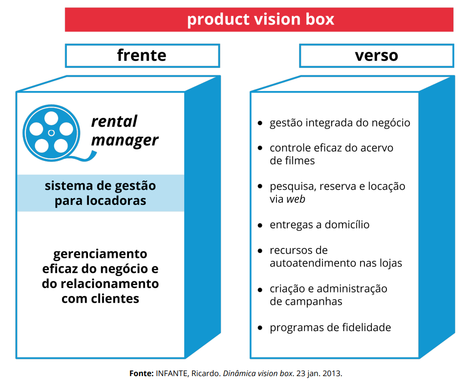

---

### Elevator Speech

Um Elevator Speech é um resumo breve e eficaz de um produto ou processo, que deve ser capaz de ser explicado em até três minutos (o tempo de uma viagem de elevador).

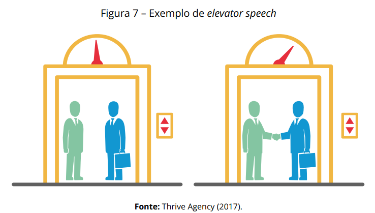

---

### Persona

Uma **persona** é um arquétipo de um usuário do produto. A criação de personas envolve:

- Manter as personas concisas e realistas.
- Conectar as personas com as histórias de usuário.
- Testar as personas com dados reais.

---

### História de Usuário ou User Story

As **histórias de usuário** são descrições simples dos requisitos do produto, focando nas necessidades dos usuários. Elas são formatadas como:

> **Como** um <usuário>, **quero** <o quê>, **para** <por quê>.

---

### Refinamento do Backlog

O **refinamento do backlog** envolve atividades contínuas para manter o backlog atualizado e relevante. Algumas atividades incluem:

- Remover histórias de usuário irrelevantes.
- Criar novas histórias.
- Reavaliar prioridades.

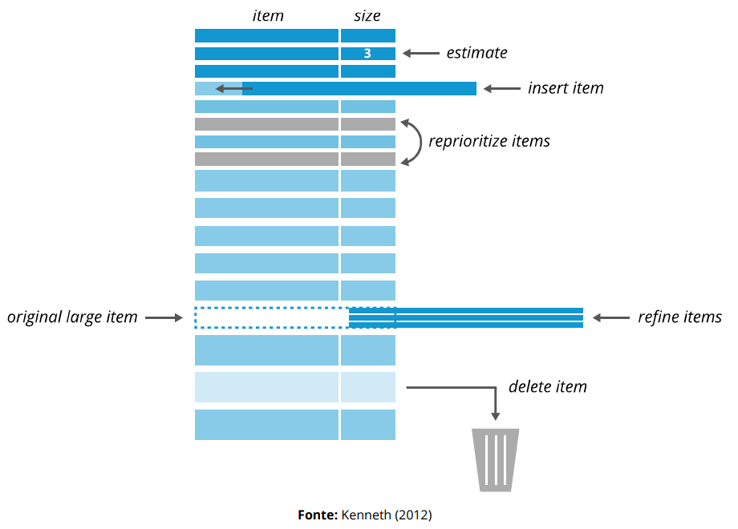

---

### Planning Poker

O **Planning Poker** é uma técnica de estimativa de esforço utilizada pela equipe. Durante o planejamento, os membros da equipe atribuem pontos a cada história com base na complexidade e no esforço necessário.

---

### Escalas para Definição de Story Points

A definição de **Story Points** pode usar várias escalas:

- **Sequência de Fibonacci**
- **Escalas Qualitativas**: Como T-shirt sizing (P, M, G) ou classificações como cães (poodle toy, pastor alemão).

---

### Sequência de Fibonacci

A **sequência de Fibonacci** é uma série de números em que cada número é a soma dos dois anteriores. Na prática, ela pode ser usada para estimar a complexidade das tarefas:

- 1, 2, 3, 5, 8, 13, 21...

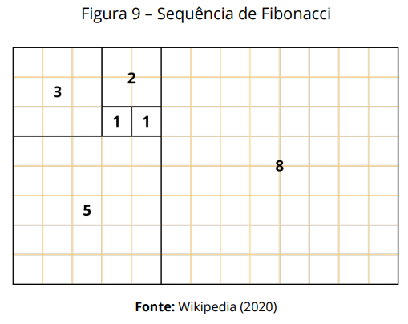

---

### Velocidade da Equipe

A **velocidade da equipe** é medida pela quantidade de pontos que a equipe consegue completar em um Sprint. Essa medida ajuda a estimar a quantidade de trabalho que pode ser feito nas próximas Sprints.

---

### Mínimo Viável do Produto

O **Mínimo Viável do Produto (MVP)** é a versão mais simples de um produto que pode ser lançada para testar no mercado ou com os clientes.

---

## Quadro de Tarefas

O **quadro de tarefas** é uma ferramenta visual para gerenciar o trabalho da equipe, similar ao quadro Kanban, mas com foco em tarefas específicas.

---

## Burn Down Chart

O **Burn Down Chart** é um gráfico que mostra o progresso do time ao longo de uma Sprint, indicando quanto trabalho resta para ser feito.

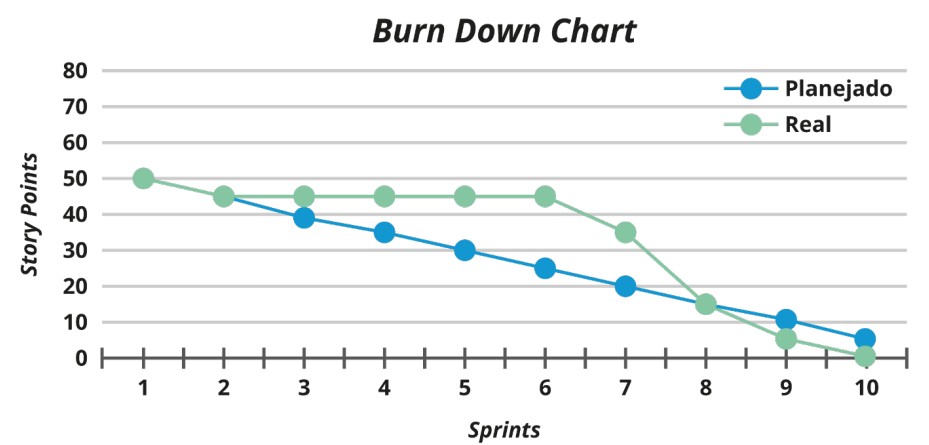

---

## Burn Up Chart

O **Burn Up Chart** é um gráfico que mostra o progresso do time em relação ao objetivo total de uma Sprint, indicando o trabalho completado e o total de trabalho.
